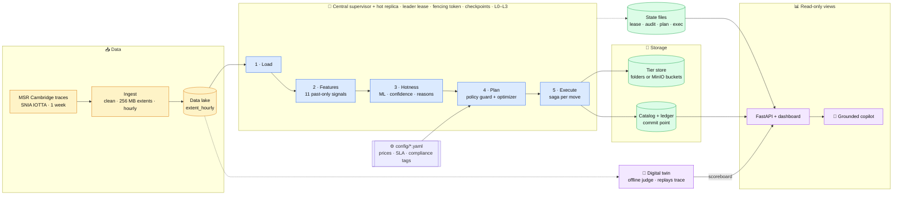
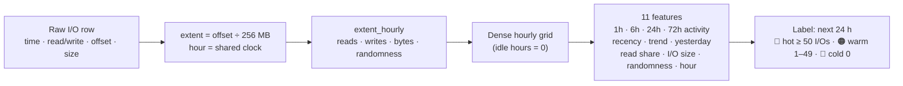
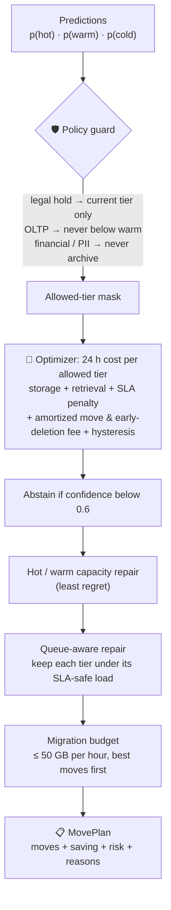
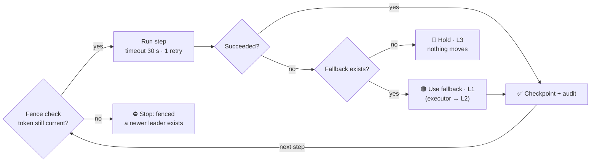
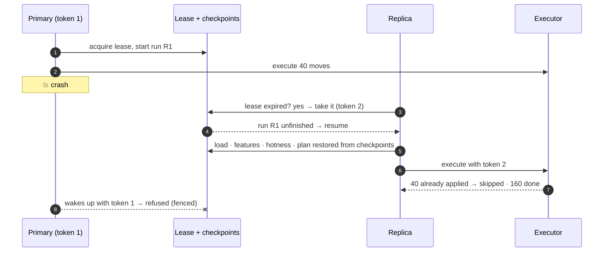
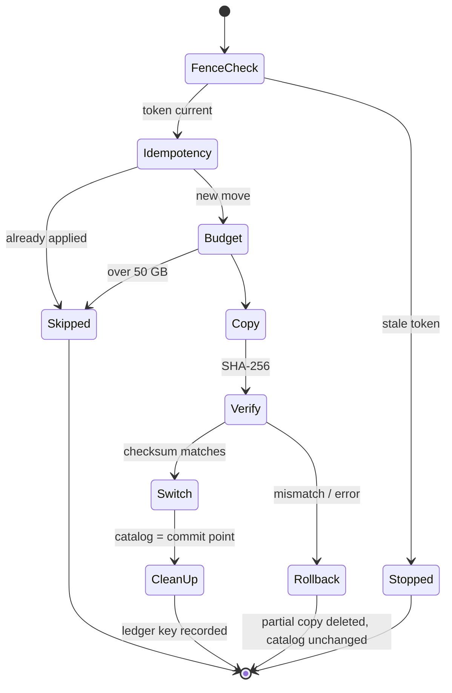
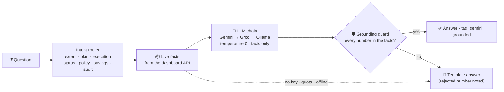

<div align="center">

# 🗂️ Ayojna

### AI that plans where every byte should live

**Predict tomorrow's hot data · Place it on the cheapest storage that keeps its promises · Move it safely, even when things fail**

<br/>


-F59E0B?style=flat-square)


<br/>

| 💰 **68.5%** cheaper than all-hot | 📉 **33%** cheaper than the best rule | ⚡ **100%** SLA met | 🛡️ **100%** compliance |
|:---:|:---:|:---:|:---:|
| *synthetic 7-day trace, unseen hours* | *vs age-based tiering* | *every I/O within its latency target* | *legal hold never violated* |

</div>

---

## 📑 Contents

1. [The problem](#-the-problem)
2. [Our solution](#-our-solution)
3. [Architecture](#-architecture)
4. [How a decision is made](#-how-a-decision-is-made)
5. [Reliability: the central supervisor](#-reliability-the-central-supervisor)
6. [Safe data movement: the executor saga](#-safe-data-movement-the-executor-saga)
7. [The grounded AI copilot](#-the-grounded-ai-copilot)
8. [Results](#-results)
9. [Tech stack](#-tech-stack)
10. [Quick start](#-quick-start)
11. [Live demo script](#-live-demo-script)
12. [API](#-api)
13. [Repository structure](#-repository-structure)
14. [Testing](#-testing)
15. [Design decisions](#-design-decisions)
16. [Roadmap](#-roadmap)
17. [Team and credits](#-team-and-credits)

---

## 🔥 The problem

Enterprises keep almost all their data on **expensive, fast storage**, although most of it is rarely read.

| Tier | Example | Price ($/GB-month) | Latency |
|---|---|---:|---:|
| 🔴 Hot | NVMe / premium SSD | 0.100 | 0.1 ms |
| 🟠 Warm | Standard SSD | 0.045 | 0.5 ms |
| 🔵 Cold | HDD / infrequent access | 0.0125 | 8 ms |
| 🟣 Archive | Deep archive | 0.002 | ~1 hour |

Today's tiering tools fall short in four ways:

- ⏱️ **They react late.** Idle-timers demote data only after it has gone quiet, and promote it only after a slow read has already hurt a user.
- ⚖️ **They ignore the rules.** In our twin, the age rule moves data under legal hold, so compliance drops to 89%.
- 💸 **They ignore the cost of moving.** Copies, retrieval fees and early-deletion fees can cost more than the move saves.
- 💥 **They are fragile.** A crashed controller or a half-finished copy can lose or duplicate data.

> **The question we answer:** for every 256 MB slice of every disk, which tier should it live on *tomorrow*, so the bill is lowest **without** breaking latency SLAs or compliance, and how do we move it there **safely**?

---

## 💡 Our solution

Ayojna is a closed loop with five ideas working together:

| # | Idea | What it means |
|:-:|---|---|
| 1 | 🔮 **Predict, don't react** | A gradient-boosted model forecasts each extent's next-24-hour hotness (hot / warm / cold), with confidence and reasons |
| 2 | 🛡️ **Compliance first** | A policy guard removes every illegal tier *before* any cost is computed, so compliance holds by construction |
| 3 | 🧮 **Price every option** | The optimizer chooses the cheapest allowed tier over 24 h. It counts storage, retrieval, SLA risk, queueing, move cost and early-deletion fees |
| 4 | 🔁 **Never stop, never double-act** | A central supervisor with a hot replica, a leader lease and fencing tokens. Each step has a fallback, and the system degrades through levels L0 to L3 |
| 5 | 🧾 **Move safely, explain everything** | A copy-verify-commit saga with rollback, an audit trail, a live dashboard and an LLM copilot that cannot invent numbers |

---

## 🏗️ Architecture



| Flow | Path | Guarantee |
|---|---|---|
| **Data** | traces → extent_hourly → features → predictions | Every table is validated against a column contract |
| **Decision** | predictions + policy mask + prices → optimizer → MovePlan | Every message carries an envelope: run id, model and policy version, fencing token |
| **Control** | supervisor runs load → features → hotness → plan → execute | Each step has a timeout, retry, fallback and checkpoint |
| **Evidence** | digital twin replays the same unseen hours for every strategy | A fair, repeatable comparison |

> 💡 **Only the Execute step touches stored data.** The dashboard and copilot only *read* what the loop writes, so they can fail without affecting storage.

---

## 🧮 How a decision is made

### 1 · From raw I/O to features



- **Leak-free split:** the test set is the last 24 labelled hours. Training labels must end before the test starts, which leaves a 24-hour gap.
- **Model:** scikit-learn `HistGradientBoostingClassifier` with balanced class weights. Synthetic test: **macro-F1 0.872 vs 0.727** for the rule baseline.
- **Honest uncertainty:** below 0.6 confidence the model *abstains* and the extent stays where it is.
- **Explainable:** each prediction carries up to 3 reasons, e.g. *"I/Os in the last 72 h = 0"*.
- **Promotion gate:** a model goes live only if it beats the rule baseline. Otherwise the rule stays in charge.

### 2 · From prediction to placement



| Planner setting | Value | Why |
|---|---|---|
| Horizon | 24 h | Matches the prediction window |
| SLA penalty | $0.0005 per I/O expected to miss | Speed has a price |
| Move amortization | 168 h | A move pays back over its stay |
| Hysteresis | $0.0005 | Stops flip-flopping |
| Queue headroom | 70% of the SLA-safe load | Real traffic queues; latency = base ÷ (1 − load) |
| Migration budget | 50 GB/h | Moves share bandwidth with users |

---

## 🔁 Reliability: the central supervisor



| Level | Meaning | Example trigger |
|:-:|---|---|
| 🟢 **L0** | Normal: every step used its primary path | Healthy run |
| 🟠 **L1** | Degraded: a fallback was used | No promoted model → rule baseline; planner failure → hold plan |
| 🟡 **L2** | Recommend-only: plan shown, nothing moves | `--recommend-only`, or storage unreachable |
| 🔴 **L3** | Hold: a critical step failed | Hotness step fails with no fallback |

### Failover without double work



---

## 🧾 Safe data movement: the executor saga



**Why this is safer than "copy the file":**

- 🔒 **Fencing:** a deposed leader cannot move data.
- 🔁 **Idempotency keys** (`run:volume:extent:tier`): a replay after failover never moves anything twice.
- ✅ **Checksum before commit:** a corrupted copy is rolled back (`--corrupt-move` demo).
- 📍 **One commit point:** only the catalog decides which copy is real, so a crash can never leave two live copies.
- 🧱 **Pluggable storage:** local folders by default, real **MinIO** buckets with `--store-kind minio`.

---

## 🤖 The grounded AI copilot

Ask in plain English: *"Why is web_0/3 on warm?"*, *"Any rollbacks?"*, *"How much are we saving?"*



- **Read-only by design:** the LLM explains decisions, it never makes them. Storage moves stay with tested, deterministic code.
- **Hallucination-proof numbers:** an answer saying *"91.2%"* when the facts say 68.53% is rejected automatically.
- **Free and resilient:** Gemini (free tier, with automatic Flash-Lite fallback when busy), then Groq (`gpt-oss-120b`), then local Ollama (offline), then templates. The copilot never goes down.

---

## 📈 Results

### Digital-twin race on the synthetic 7-day trace (scored only on unseen hours 120–167)

| Strategy | $ / month | Saving vs all-hot | SLA met | Compliance | GB moved | Hours over hot capacity |
|---|---:|---:|---:|---:|---:|---:|
| all_hot | 13.825 | 0.0% | 100.00% | 100% | 0 | 48 |
| age_rule | 6.501 | 53.0% | 99.99% | 89.0% | 31.75 | 48 |
| access_timer | 8.343 | 39.6% | 100.00% | 89.0% | 24.25 | 48 |
| lru | 8.166 | 40.9% | 100.00% | 87.7% | 202.00 | 0 |
| **🏆 ayojna** | **4.351** | **68.5%** | **100.00%** | **100%** | 0 | **0** |

### Real MSR Cambridge traces (8 days, scored on unseen hours)

Scored on unseen hours 72-119; predictions: primary / ok (model 20261009-041323)

| Strategy | $/month | Saving vs all-hot | SLA met | Compliance | GB moved | Over hot cap (h) |
|---|---:|---:|---:|---:|---:|---:|
| all_hot | 13.700 | 0.0% | 100.00% | 100.0% | 0.00 | 48 |
| age_rule | 8.351 | 39.0% | 100.00% | 91.6% | 49.25 | 48 |
| access_timer | 9.712 | 29.1% | 100.00% | 91.6% | 45.25 | 48 |
| lru | 11.777 | 14.0% | 100.00% | 86.7% | 406.00 | 0 |
| ayojna | 4.372 | 68.1% | 100.00% | 100.0% | 0.00 | 0 |


> 🔬 **Engineering note:** on real traffic, the first planner version reached 66.1% saving but only 83.7% SLA. Real traces carry about 100 times more I/O than our synthetic data, so the cold tier was queueing. We traced this with `python -m ayojna.planner.diagnose` and made the optimizer **queue-aware**: it now keeps every tier under the load at which latency would exceed its SLA.

### Model and reliability

| Check | Result |
|---|---|
| Hotness model (synthetic test hours) | macro-F1 **0.872** vs rule 0.727 · hot recall 0.905 · abstain 1.0% |
| Crash after 40 moves → replica takeover | Token 2, run resumed, **160 done · 40 skipped · 0 duplicates** |
| Corrupted copy | Detected by checksum, **rolled back**, catalog unchanged |
| Planner fault / storage down / model fault | Degrades to **L1 / L2 / L3** instead of crashing |
| Live placement (synthetic) | Converges in ~4 cycles (200 → 200 → 75 → 0 moves), ~68.8% live saving |

---

## 🧰 Tech stack

<div align="center">

**Core and data**


**Machine learning and optimization**


**Reliability and storage**


**API, dashboard and AI**


**Quality**


</div>

| Layer | Choice | Why |
|---|---|---|
| Data | pandas + Parquet, streamed ingest | Laptop-friendly; 5 GB of traces read in 1M-row chunks |
| Contracts | Pydantic + column specs | Two builders, one source of truth; bad shapes fail loudly |
| ML | scikit-learn HistGradientBoosting | Best fit for tabular, mixed-scale features; fast on CPU; no GPU |
| Decision | NumPy vectorized optimizer | Thousands of extents priced in milliseconds |
| Reliability | File-based lease, fencing, checkpoints | Runs anywhere with no extra service; same interface can move to Redis |
| Storage | Folder tiers or MinIO (S3 API) | Same 4 operations, swappable with one flag |
| API / UI | FastAPI + one-file Chart.js page | Auto-generated docs at `/docs`; works offline without charts |
| AI | Gemini / Groq / Ollama over plain HTTPS | Free, no SDK lock-in, offline fallback |

---

## 🚀 Quick start

```bash
# 1. Clone and install
git clone https://github.com/vaishnavi-212/Ayojna.git && cd Ayojna
python -m venv .venv
source .venv/bin/activate              # Windows: .\.venv\Scripts\Activate.ps1
pip install -r requirements.txt && pip install -e .

# 2. Check everything works
python -m pytest -q                    # 83 passed

# 3. Run the whole system on a synthetic trace and open the dashboard
python -m ayojna.demo --serve          # → http://localhost:8000  ·  API docs: /docs
```

### Real MSR Cambridge traces

1. Download **MSR Cambridge Traces** from [SNIA IOTTA](https://iotta.snia.org/traces/block-io/388) (accept the license; ~5 GB).
2. Drop the downloaded archive(s) into `data/raw/msr/`. **Don't unzip them.**
3. `python -m ayojna.ingest.real --list` shows the volumes found.
4. `python -m ayojna.demo --source real --serve`

### Optional: free AI copilot

```bash
cp .env.example .env       # then add GEMINI_API_KEY (aistudio.google.com) and/or GROQ_API_KEY
```

Without a key the copilot still answers, using templates.

---

## 🎬 Live demo script

| # | Show | Command | What the judges see |
|:-:|---|---|---|
| 1 | Full pipeline | `python -m ayojna.demo --source lake --serve` | Six stages, then the results table |
| 2 | Dashboard | open `localhost:8000` | KPIs, cost race, live tier mix, plan with reasons |
| 3 | Copilot | Ask *"How much are we saving?"* | Green tag **gemini, grounded** |
| 4 | Failover | primary `--crash-after-moves 40`, then a replica | Token 2, **skipped 40**, no duplicates |
| 5 | Bad copy | `python -m ayojna.supervisor.run --cycles 1 --corrupt-move` | **Rolled back 1** in red |
| 6 | Degradation | `--fail hotness` / `--recommend-only` | Badge turns **L3** / **L2** |
| 7 | Root cause | `python -m ayojna.planner.diagnose` | SLA misses by volume, tier and cause |

---

## 🔌 API

| Endpoint | Returns |
|---|---|
| `GET /api/kpis` | Saving vs all-hot and vs best rule, SLA, compliance, live saving, level |
| `GET /api/status` | Leader, fencing token, lease, active run, last cycle |
| `GET /api/scoreboard` | Twin race summary + cumulative cost per strategy |
| `GET /api/placement` | Extents and GB per tier, monthly cost now vs all-hot |
| `GET /api/plan` | Latest plan with saving, risk and reasons per move |
| `GET /api/execution` | Done · skipped · rolled back · over budget · fenced |
| `GET /api/audit` | Newest audit events |
| `GET /api/explain/{volume}/{extent}` | Tier, allowed tiers, policy reasons, planned move |
| `POST /api/ask` | Copilot answer + source (llm / template) + note |

---

## 🗺️ Repository structure

```
Ayojna/
├── ayojna/
│   ├── contracts/     🧾 shared types: Tier, Envelope, Move, MovePlan, table specs
│   ├── ingest/        📥 MSR parser · synthetic generator · streaming real-trace reader
│   ├── models/        🔮 features · labels · rule baseline · ML model · promotion gate
│   ├── twin/          🧪 digital twin · 4 baseline strategies · race
│   ├── policy/        🛡️ compliance guard (legal hold, SLA floors, no-archive)
│   ├── planner/       🧮 optimizer · live planner · evaluation · SLA diagnose
│   ├── supervisor/    🔁 lease + fencing · checkpoints · cycle runner · CLI
│   ├── executor/      🧾 tier store (folders / MinIO) · catalog · move saga
│   ├── api/           🔌 read-only service · FastAPI app · scoreboard snapshot
│   ├── copilot/       🤖 intent router · grounding guard · LLM chain
│   └── demo.py        🎬 one command for the whole pipeline
├── config/            ⚙️ tiers · sla · compliance · models · twin · policy · planner (YAML)
├── tests/             ✅ 14 files · 83 tests
├── web/index.html     📊 control-room dashboard
├── docker-compose.yml 🐳 MinIO for real object storage
└── data/              🔒 raw · lake · state · tiers (git-ignored)
```

---

## ✅ Testing

| Area | What the tests prove |
|---|---|
| Contracts and config | Bad shapes and bad prices are refused |
| Ingestion | Bad rows rejected; streaming output equals in-memory output exactly |
| Features and ML | No future leakage; model explains itself and falls back when missing or broken |
| Twin, policy and planner | Legal hold never moves; SLA floors hold; capacity, queueing and budget respected |
| Supervisor | Lease takeover, fencing, retry, timeout, fallback, L3 hold, crash resume |
| Executor | Idempotent replay, rollback on bad copy, fenced leader moves nothing |
| API and copilot | Full loop through the API; invented numbers rejected; provider fallback |

```bash
python -m pytest -q   # 83 passed
```

---

## 🧠 Design decisions

| Choice | Reason |
|---|---|
| **256 MB extents** | Small enough to target hot spots, large enough to track cheaply |
| **24 h horizon** | One daily cycle; prediction and cost horizon aligned |
| **Rule baseline + promotion gate** | ML must *earn* its place; the rule is also the fallback |
| **Policy before optimization** | Compliance can never be traded for money |
| **Queue-aware placement** | Real traffic queues; base latency alone is not enough |
| **Digital twin** | Fair, repeatable comparison on the same unseen hours |
| **Lease + fencing token** | Exactly one leader can act; stale leaders are refused |
| **Checkpoints + idempotency** | A replica resumes instead of redoing work |
| **Saga with one commit point** | All-or-nothing moves without distributed transactions |
| **Read-only, grounded LLM** | Explanation adds trust; decision power would add risk |

---

## 🛣️ Roadmap

- 🗄️ Redis-backed state store (same interface as today's file store; the Redis service is already in `docker-compose.yml`)
- ☁️ Cloud tier adapters (S3 / Azure Blob / GCS lifecycle APIs) next to MinIO
- 📆 Multi-week training to learn weekly patterns (day-of-week is computed but held out today)
- 🏷️ Real compliance tags from a metadata catalog (today they are synthetic, per volume, in YAML)

---

## 👥 Team and credits

<div align="center">

**Team CodeBlooded · Hackfest 2026 · Problem Statement 2A**

| Bhoomi B | Vaishnavi K | Joel B | Aditya P |
|:---:|:---:|:---:|:---:|
| Reliability & execution | Data & ML | Optimization & policy | API, dashboard & copilot |

</div>

**Dataset:** MSR Cambridge block I/O traces, [SNIA IOTTA](https://iotta.snia.org/traces/block-io/388). D. Narayanan, A. Donnelly, A. Rowstron, *"Write Off-Loading: Practical Power Management for Enterprise Storage"*, USENIX FAST 2008. The traces are used under the SNIA trace license and are not redistributed in this repository.

<div align="center">
<sub>Built with care by Team CodeBlooded · <i>Ayojna</i> (आयोजना) means "planning"</sub>
</div>